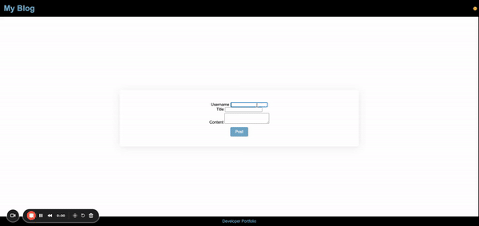
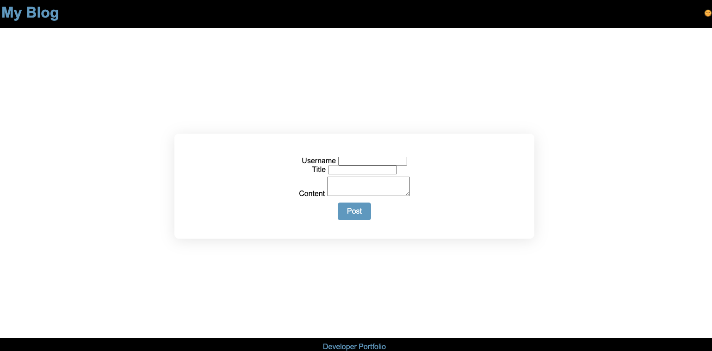
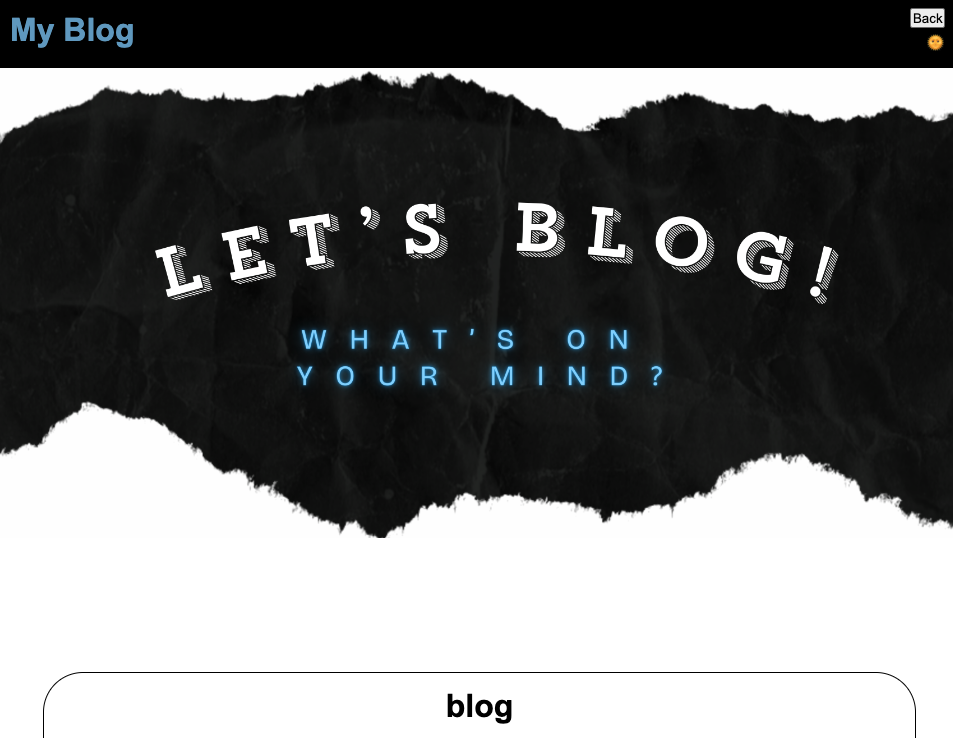

# My Blog 📝

## Goal

Create a two-page website where users will input and view blog posts. It includes building a content form, dynamically rendering blog posts, and implementing a light/dark mode toggle. 

## Functionality
This web application was created with HTML, CSS, and JS. The purpose of this project is to hold blog entries and save them to be navigated through using scroll. The homepage features a form to create a blog. Both the index.html and blog.html pages have light dark mode toggles represented by emojis. The blog.html page offers a back button to navigate back to the form to create a new post again. Both pages have a MyBlog button that takes you to the form page as well. To use the blog the Username, Title, and content fields must be filled out to reflect all three components on the full index.html page. The bottom footer has a 'developer portoflio' to take the user to the developer 'portfolio page'.

## Mock-Up

The following is a link to the repository: [Blog repository](https://github.com/brandeecheung/myblog) and the Blog itself: [Blog site](https://brandeecheung.github.io/myblog/).

The following animation shows the web application's appearance and functionality:

The following screenshots show the web application's appearance and functionality:

